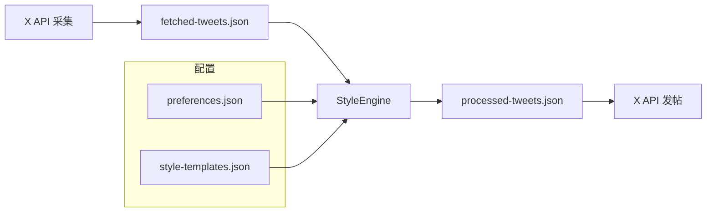

# x-publisher — OpenClaw X 自动发帖技能

基于官方 **X API** 的最小流水线：**采集** → **按偏好与风格加工** → **发帖**。可选 **OpenAI** 做文风改写；无 Key 时使用简单规则降级。

## 目录结构

```text
x-publisher/
├── SKILL.md                 # OpenClaw 技能说明（frontmatter + 使用步骤）
├── skill.json               # 技能清单（权限、触发词、运行环境等）
├── openclaw.plugin.json     # 指向本目录为技能包（skills: ["."]）
├── README.md                # 本文件
├── package.json             # Node 依赖与 npm scripts
├── tsconfig.json            # TypeScript（ESM + Node 类型）
├── .env.example             # 环境变量模板
├── .gitignore
├── config/
│   ├── preferences.json     # 兴趣词、规避主题、语言等（智能体喜好）
│   └── style-templates.json # 各风格 prompt / 长度 / 表情开关
├── scripts/
│   ├── fetch-tweets.ts      # ① 采集：search | timeline | trending
│   ├── process-tweet.ts     # ② 加工：过滤 + 风格化
│   ├── publish-tweet.ts     # ③ 发布单条（支持 --dry-run）
│   └── utils/
│       ├── x-client.ts      # twitter-api-v2 封装
│       ├── style-engine.ts  # 偏好过滤 + OpenAI/规则改写
│       └── logger.ts
└── data/
    └── cache/               # 运行时生成（已 .gitignore），存放 fetched / processed JSON
```

## 项目框架（数据流）



1. **采集**（`fetch-tweets.ts`）：`search` / `timeline` 会把 v2 返回里的 **`data` 推文数组**写入 `data/cache/fetched-tweets.json`，可直接给下一步用。`trending` 为话题元数据，需再 `search` 才能得到推文数组。
2. **加工**（`process-tweet.ts`）：按 `preferences` 过滤，再按 `style-templates` 与 `-s` 风格生成 `processedText`。
3. **发布**（`publish-tweet.ts`）：读取加工结果，默认发 `--index 0`；建议先发 `--dry-run` 检查正文。

## 身份验证（OAuth 2.0）

本仓库的 X 请求使用 **OAuth 2.0 User Context**（与 OAuth 1.0a 的 API Key + Access Token / Secret 不同）。

| 变量 | 说明 |
|------|------|
| `X_OAUTH2_ACCESS_TOKEN` | 用户授权后的 Access Token（Bearer），**推荐** |
| `X_CLIENT_ID` | OAuth 2.0 Client ID |
| `X_CLIENT_SECRET` | 保密（Confidential）应用必填；公开（Public）应用可省略 |
| `X_OAUTH2_REFRESH_TOKEN` | 与 `CLIENT_ID` 配合，在无 access token 时自动刷新 |

在 [X Developer Portal](https://developer.x.com) 启用 OAuth 2.0，授权时勾选发帖、读推等所需 scope（如 `tweet.read`、`tweet.write`、`users.read` 等）。`scripts/utils/x-client.ts` 内通过 `TwitterClient.create()` 解析令牌并创建 `readWrite` 客户端。

## 快速开始

```bash
cp .env.example .env   # 填写 OAuth 2.0 变量；可选 OPENAI_API_KEY
npm install
npx tsx scripts/fetch-tweets.ts --source search --topic "TypeScript -is:retweet" --count 15
npx tsx scripts/process-tweet.ts -i data/cache/fetched-tweets.json -s professional
npx tsx scripts/publish-tweet.ts -i data/cache/processed-tweets.json --dry-run
```

## 本次结构调整说明

- 已删除根目录误放的 **`config.json`**（原内容为其他 Python/爬虫项目，与本技能无关）。
- **`skill.json`** 的 `requires.bins` 已与实现一致改为 **`node`**，并允许通过环境变量注入密钥。
- 根目录 **`SKILL.md`** 作为 OpenClaw 可读技能入口；**`openclaw.plugin.json`** 声明 `skills: ["."]`，与同仓库 **clawbird** 的接入方式一致。

## 许可

见 `skill.json` 中的 `license` 字段。
